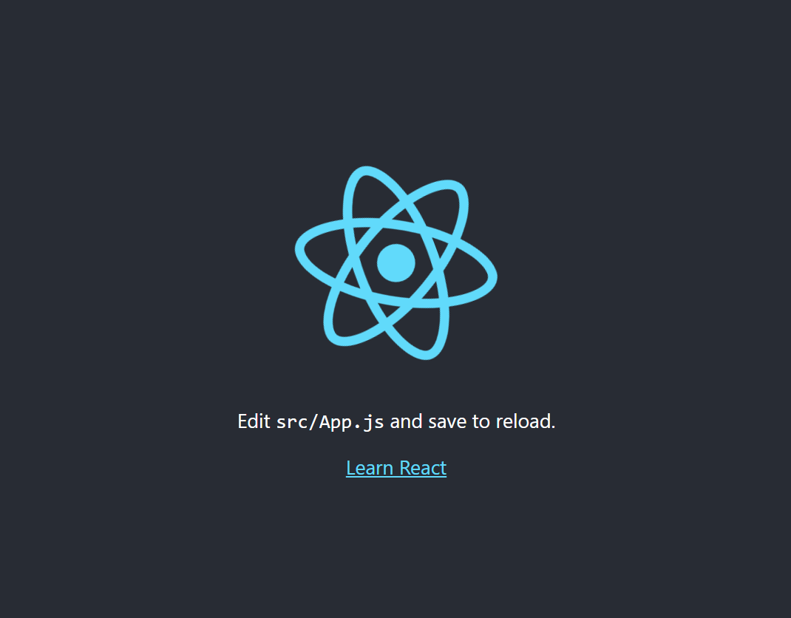

# Aula 16 - 04/12/24

### 1. Configuração do workspace
- Usado o comando **git init** para tornar o diretorio um repositorio
- Utilizando o comando **npx create-react-app task-manager** para configurar o workspace para um projeto react app
- Apos utilizar o comando **npm start** o ambiente gerado é exibido no navegador como a imagem a seguir

### 2. Criação de componentes 
- No arquivo **App.js** foi retirado seu conteudo default e iniciado uma estrutura base para receber dois componentes que iriam ser criados
- Criada a pasta **components** dentro do diretorio **src** para receber os componentes iniciais sendo eles o **Header.js** e o **TaskContainer.jsx**
- Apos as mudanças acima nossa pagina fica totalmente em branco por não ter nenhuma informação configurada

### 3. Configuração dos componentes 
- 
