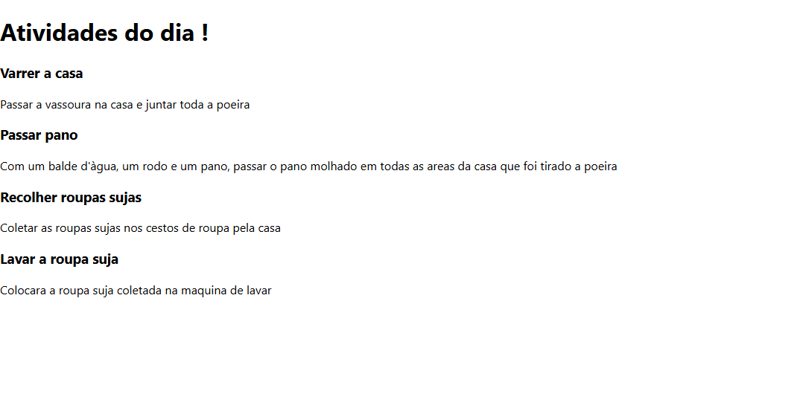

# Aula 16 - 04/12/24

### 1. Configuração do workspace
- Usado o comando **git init** para tornar o diretorio um repositorio
- Utilizando o comando **npx create-react-app task-manager** para configurar o workspace para um projeto react app
- Apos utilizar o comando **npm start** o ambiente gerado é exibido no navegador como a imagem a seguir

### 2. Criação de componentes 
- No arquivo **App.js** foi retirado seu conteudo default e iniciado uma estrutura base para receber dois componentes que iriam ser criados
- Criada a pasta **components** dentro do diretorio **src** para receber os componentes iniciais sendo eles o **Header.js** e o **TaskContainer.jsx**
- Apos as mudanças acima nossa pagina fica totalmente em branco por não ter nenhuma informação configurada

### 3. Configuração dos componentes 
- Criada as suas respectivas funções do **Header.js** (Exibir o titulo do projeto) e do **TaskContainer.jsx** (Exibir as tarefas determinadas) suas funções foram exportadas para o arquivo **App.js** tendo como resultado a baixo na imagem

### 4. Aprimoramento do componente Taskontainer
- Criado um novo component com arquivo nomeado de **Task.js** para ser o criador dos elementos das tarefas
- Modificação do **TaskContainer.jsx** onde as tarefas agoras estão agrupadas num array em forma de dicionario e a função **Task** é chamada para formatar as informações contidas no array
- Visualmente não ocorrem alterações na exibição dos componentes por ter mantido o mesmo formato de exibição